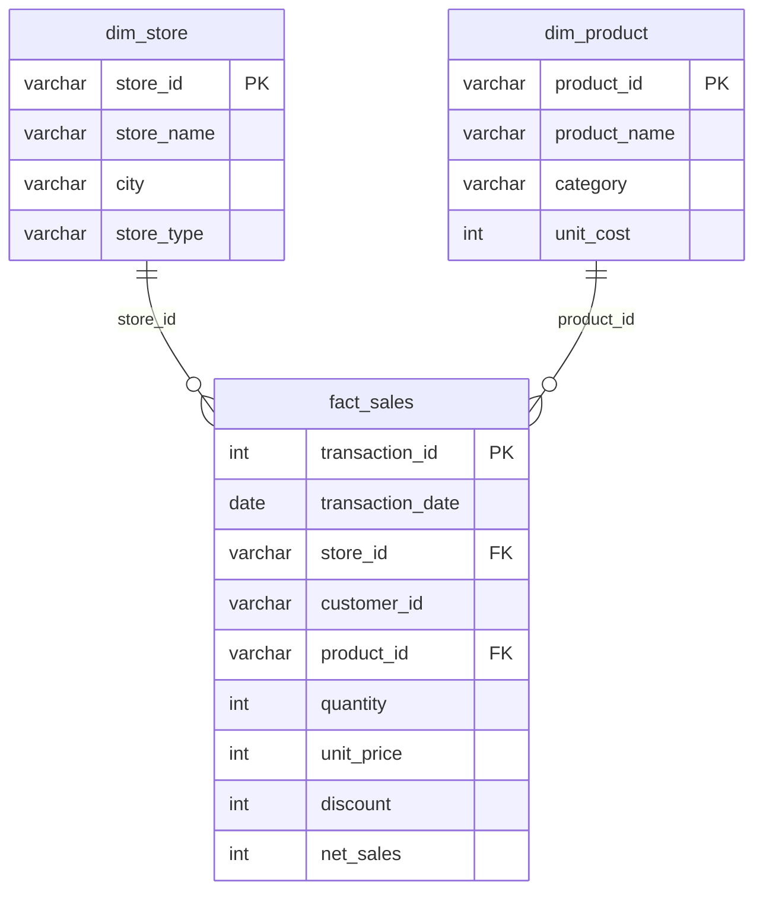

# Retail SQL Practice (SQL Server)

Real-world retail questions, real SQL skills. Levels 1-2 cover five core skills, and Level 3 adds a profitability exercise with JOINs, KPIs and validation. Each query answers a question a Sales, Store or Category Manager might ask.

> The dataset is **synthetic** (made up for practice). No real company data is used.

## What's inside

| File | Purpose |
|---|---|
| `setup.sql` | Creates the database, tables and all sample data (run this first) |
| `queries.sql` | The 5 solved queries (Levels 1-2) with the business question above each one |
| `level3_store_profitability.sql` | Level 3 exercise: store profitability (JOIN + KPIs + validation) |
| `fact_sales.csv`, `dim_product.csv`, `dim_store.csv` | The same data as CSV files |

## The 5 questions

| # | Business question | SQL skill |
|---|---|---|
| 1 | Show store S01's transactions from Jan 1 to Jan 10, 2025 | `WHERE` + date filtering |
| 2 | How much did each store sell? | `GROUP BY`, `SUM`, `COUNT` |
| 3 | Which product categories perform best? | `JOIN` (fact + dimension) |
| 4 | Which sales are low, medium or high value? | `CASE` |
| 5 | What are the best-selling products in each category? | `RANK() OVER (PARTITION BY ...)` + CTE |

## Dataset

A small star schema: one fact table and two dimension tables.

- **508 transactions** from Jan 1 to Mar 31, 2025
- **16 products** in 5 categories, **6 stores** in 4 cities, 60 customers
- `net_sales = quantity * unit_price - discount` (the discount is a flat amount)

## How to run it

1. Open **SQL Server Management Studio (SSMS)** and connect to your server.
2. Open `setup.sql` and click **Execute**. The last query should return `16 | 6 | 508`.
3. Open `queries.sql` and run each query one at a time (highlight it, then press **F5**).
4. For Level 3, open `level3_store_profitability.sql` and run each query the same way.

`setup.sql` is safe to re-run: it drops and recreates the three tables.

## Sample results

**Query 2: net sales by store**

| store_id | total_net_sales | total_units_sold | number_of_transactions |
|---|---|---|---|
| S02 | 31,047 | 483 | 114 |
| S04 | 26,967 | 474 | 109 |
| S01 | 21,670 | 435 | 103 |
| S03 | 18,145 | 355 | 84 |
| S06 | 11,583 | 196 | 46 |
| S05 | 11,558 | 224 | 52 |

**Query 5: best sellers per category (first rows)**

| category | product_name | total_net_sales | sales_rank |
|---|---|---|---|
| Beverages | Mineral Water Pack | 5,769 | 1 |
| Beverages | Orange Juice | 2,029 | 2 |
| Electronics | Headphones | 10,923 | 1 |
| Electronics | Electric Kettle | 7,547 | 2 |
| Grocery | Dates | 15,110 | 1 |
| Grocery | Basmati Rice | 13,550 | 2 |

## Level 3: Store profitability (JOIN + KPI + Validation)

**Business problem:** the Retail Manager says Store S02 sells a lot, but wants to know whether it is still strong after considering profitability.

**Tables combined:** `fact_sales` -> `dim_product` (for `unit_cost`) -> `dim_store` (for `store_name`)

**KPIs per store**

| KPI | Formula |
|---|---|
| Net Sales | `SUM(net_sales)` |
| Gross Profit | `SUM(net_sales - quantity * unit_cost)` |
| Gross Margin % | `Gross Profit / Net Sales * 100` |

**Query:** [`level3_store_profitability.sql`](level3_store_profitability.sql)

**Result**

| store | net_sales | gross_profit | gross_margin_pct | rank by sales | rank by margin |
|---|---|---|---|---|---|
| S03 Jeddah Mall | 18,145 | 7,125 | 39.27 | 4 | 1 |
| S01 Riyadh Central | 21,670 | 8,500 | 39.22 | 3 | 2 |
| S02 Riyadh North | 31,047 | 12,019 | 38.71 | 1 | 3 |
| S05 Dammam Central | 11,558 | 4,386 | 37.95 | 6 | 4 |
| S04 Jeddah Corniche | 26,967 | 10,191 | 37.79 | 2 | 5 |
| S06 Khobar Express | 11,583 | 4,282 | 36.97 | 5 | 6 |

**Insight:** S02 is #1 in sales and gross profit, but only #3 in margin (38.7%). The company average margin is 38.4%, so S02 is strong, just not the margin leader.

**Validation:** total net sales after the three joins equals the raw `fact_sales` total (120,970), so no rows were dropped or duplicated.

> Practice dataset (synthetic data), not real business results.

## What I learned

- `GROUP BY` collapses rows into one per group. A window function ranks rows **without** collapsing them.
- A CTE makes an aggregate-then-rank query much easier to read.
- Sales rank alone can hide profitability. Always check margin as well.
- Validate your joins: totals before and after the joins must match.
- Protect divisions with `NULLIF` so a zero never breaks a KPI.
- Mistakes I caught in my own first drafts:
  - `BETWEEN '...' AND '2025-01-10'` can miss late-day rows if the column has a time part. Use `>= start AND < next day`.
  - A `GROUP BY` with no aggregate is unnecessary. I removed it from the CASE query.
  - `<= 499.99` leaves a gap. Use `< 500` instead.

## Next challenges

- Month-over-month sales growth with `LAG()`
- Top 3 customers per store with `ROW_NUMBER()`
- Profit margin per product and per category using `unit_cost`
- Compare `RANK`, `DENSE_RANK` and `ROW_NUMBER` on the same data

## Author

**Abu Hozaifa** | [LinkedIn](https://www.linkedin.com/in/abu-hozaifa-retail-analyst)

Feedback is welcome. I'm still learning.
